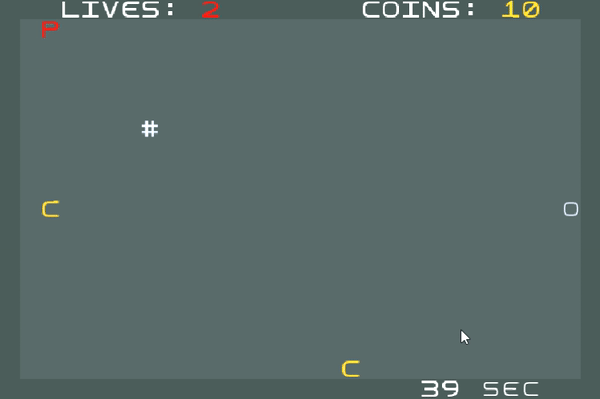
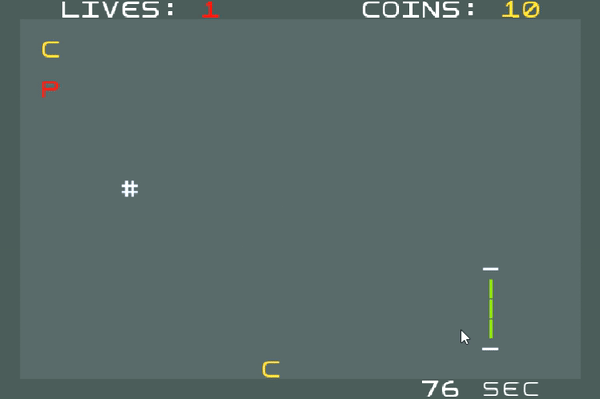

# Jetpack Joyride
## LPOO-2021-g73

This project was developed for LPOO 2020⁄21 by:
- Adriano Soares - up201904873@edu.fe.up.pt
- Catarina Pires - up201907925@edu.fe.up.pt
- Francisco Cerqueira - up201905337@edu.fe.up.pt

## Description

In this game, the Player's primary goal is to travel as far as possible, while collecting coins to buy useful power-ups, and avoiding hazards such as Energy Walls and Laser Beams. The Menus are navigable with the `Keyboard Arrows` and `Enter Key`, while the Player is controlled with the `Left Mouse Button`.

### Power Ups

Throughout the game, when the Player has at least 10 coins, he can buy a power-up from the three available.

#### Immortal `Number 1 Key`:

#### Double Coins `Number 2 Key`:

#### Slow Down Effect `Number 3 Key`:

