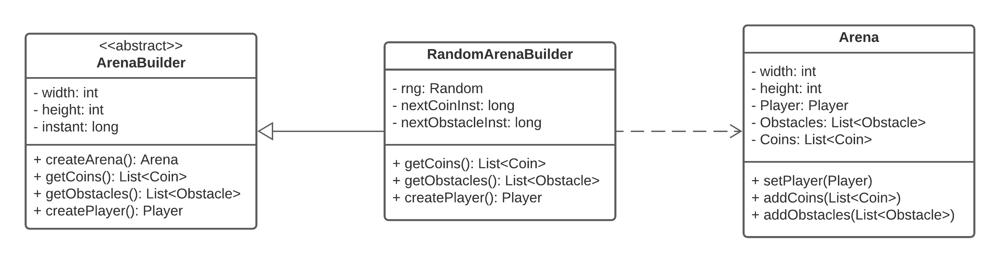
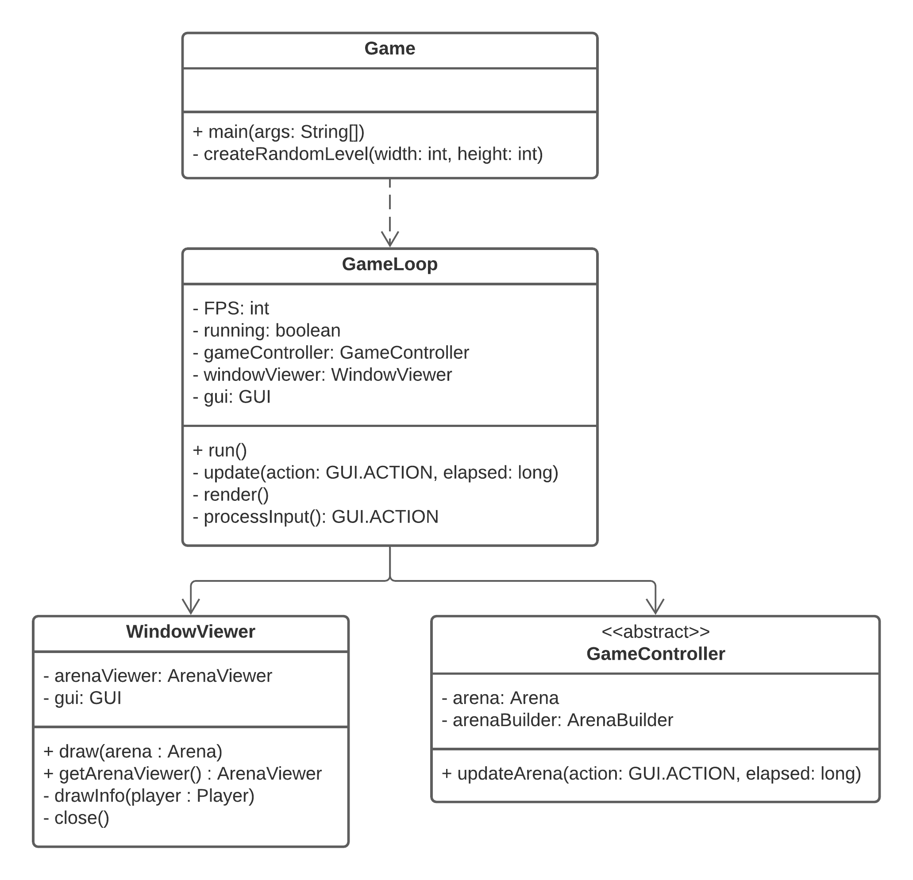
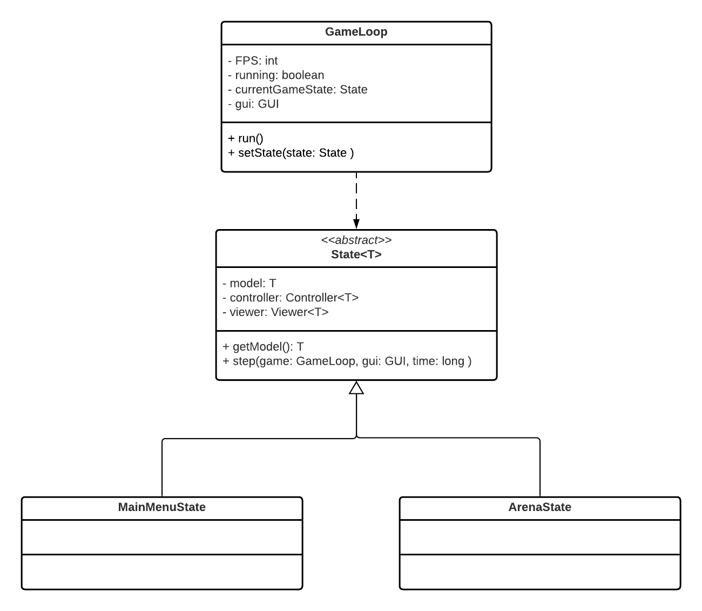
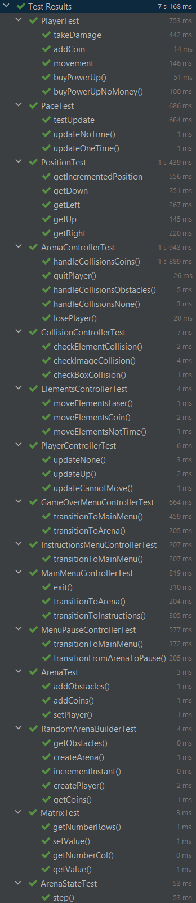
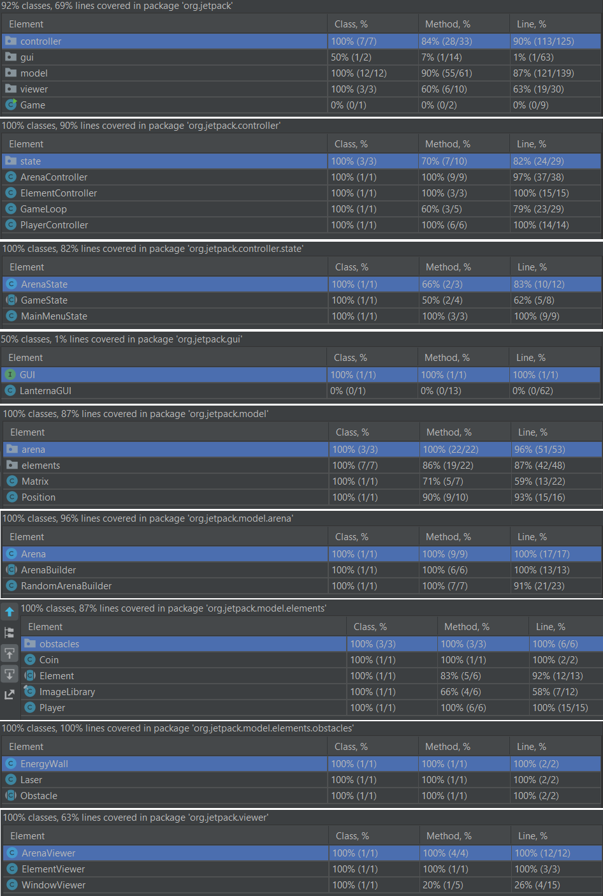
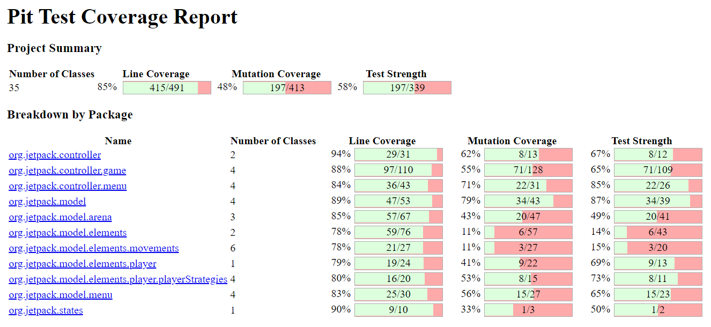

# LPOO-2021-g73 - Jetpack Joyride

This project was developed by:
- Adriano Soares (up201904873@edu.fe.up.pt)
- Catarina Pires (up201907925@edu.fe.up.pt)
- Francisco Cerqueira (up201905337@edu.fe.up.pt)

## Table of contents
1. [Description](#description)
2. [Implemented features](#implemented-features)
3. [Planned features](#planned-features)
4. [Design](#design)
    1. [Arena Builder](#i-arena-builder)
    2. [Game Loop](#ii-game-loop)
    3. [Movement Strategy](#iii-movement-strategy)
    4. [States](#iv-states)
    5. [Power Ups](#v-power-ups)
5. [Code smells and refactoring techniques](#code-smells-and-refactoring-techniques)
6. [Testing](#testing)

## Description
In this game, the Player's primary goal is to travel as far as possible, while collecting coins, and avoiding hazards such as Energy Walls and Laser Beams.

## Implemented features

- [x] Movable Objects:
  - [x] Player
  - [x] Coins
  - [x] Obstacles (Laser and EnergyWall)

- [x] Arena Builder - we created a random arena builder (RandomArenaBuilder)
- [x] Information bar - we created a window that has the player's information and, inside it, is the arena where the game runs
- [x] Collisions

## Planned features

- [ ]  Objects:
    - [ ] Static obstacles
    - [ ] Obstacle with different movements

- [ ] Movements:
    - [ ] Player falls with gravity
    - [ ] Movements aside from going left (Obstacles)

- [ ] Life system: player gains lives throughout the game (when 10 coins are collected perhaps)
- [ ] Menus
- [ ] Levels:
    - [ ] Increase the difficulty linearly throughout a play through
    - [ ] Improve Random Infinite 
    - [ ] Pre-built Levels
    - [ ] Score (Distance)
- [ ] Power-ups:
    - [ ] Shield
    - [ ] Zero Gravity
    - [ ] Nitro

## Design
### i. Arena Builder
#### Problem in context

To allow the creation of an Arena of multiple ways, randomly or by reading it from a file.

#### The pattern

To solve this problem, we implemented an Abstract Factory pattern which, depending on the what form of arena creation we want, it creates Arenas specific for it.

#### Implementation

To implement the Abstract Factory we created an abstract class, ArenaBuilder, that specifies what each arena must be able to create (player, coins, obstacles, etc). Then, various options of building an arena can implement/override the methods of the abstract class accordingly, RandomArenaBuilder. If later we wanted to add new methods to create arenas, we only need to specify the target platform when the application starts. This way, the wanted arena builder is instantiated and used throughout the rest of the program, not having to worry with the specific type in use.

#### Consequences

By using the Abstract Factory, each target platform has its own isolated concrete class, which can be implemented differently. In addition, it makes exchanging product families easy, only needing to call a different constructor at the start of the program, since they extend the same abstract class.

### ii. Game Loop
#### Problem in context

In order to control the main cycle of the game, we need a way to make sure the game runs properly, processes the input and renders accordingly with a certain amount of frames per seconds (that won't interfere in the game itself).

#### The pattern

A game loop runs continuously during the gameplay. Each turn of the loop, it processes user input without blocking, updates the game state, and renders the game. It tracks the passage of time to control the rate of gameplay.

#### Implementation

To implement the Game Loop pattern we created a class, GameLoop, that contains the three main methods stated above, and some other utility functions.

#### Consequences

The Game Loop pattern allow us to have more control in the way the game runs and separate each processing.

### iii. Movement Strategy
#### Problem in context

In order for the objects to have different types of movement, we needed to specify their movement.
This information could be placed in model, in each object's class, but it would be much to know about, and it would not concern the element itself.

#### The pattern

To solve this problem we used the Strategy Pattern. This pattern allows us to isolate the distinct movements into classes away from the object, making them interchangeable. With this, we are able to separate the movement algorithm from the objects, so we can easily switch their behaviors and add new ones.

#### Implementation

> TODO
>

#### Consequences

With this pattern, we can eliminate the possibility of differentiating each behaviour with conditional statements and substitute them with classes that have different implementation accordingly.
In this way, each object does not have to know its type of movement.

### iv. States
#### Problem in context

To switch from different states smoothly as the game proceeded. This is useful for the menus and power-ups in the game.

#### The pattern

To implement the different states of the game, we used the State Pattern. This pattern allows the implementation of each state as subclass. If so, we can switch from different states by only switching to another class.

#### Implementation

#### Consequences

This pattern facilitates the creation of more states for the game and changes to the ones already created.
The creation of different states can give us freedom to differentiate behaviors depending on the actual stage in the game.

### v. Power Ups
#### Problem in context

The player may have different attributes/stats throughout the game.

#### The pattern

To implement the power-ups we used the Command Pattern. This pattern consists of deriving power-ups from an abstract class while modifying a common function, *execute* in our case, so that they can have a different results, change different attributes and/or change the Player's state.

#### Implementation

> TODO
>

#### Consequences

This pattern eases the management and creation of the power-ups.

> TODO: Perfect

## Code smells and refactoring techniques

> TODO

## Testing

### Test Coverage

[Link to the reports in HTML format](testResults/html)