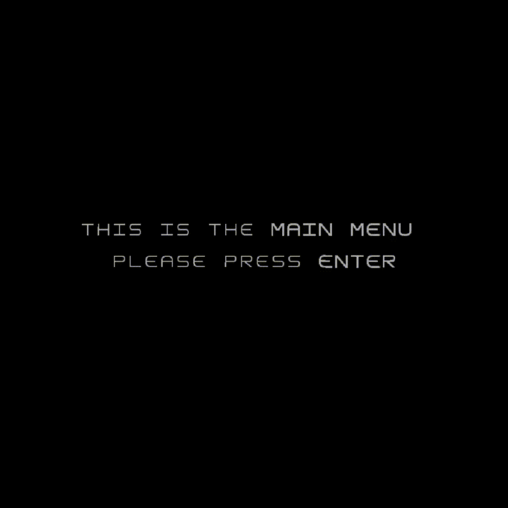
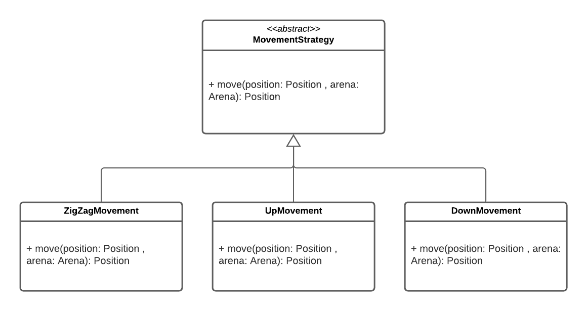
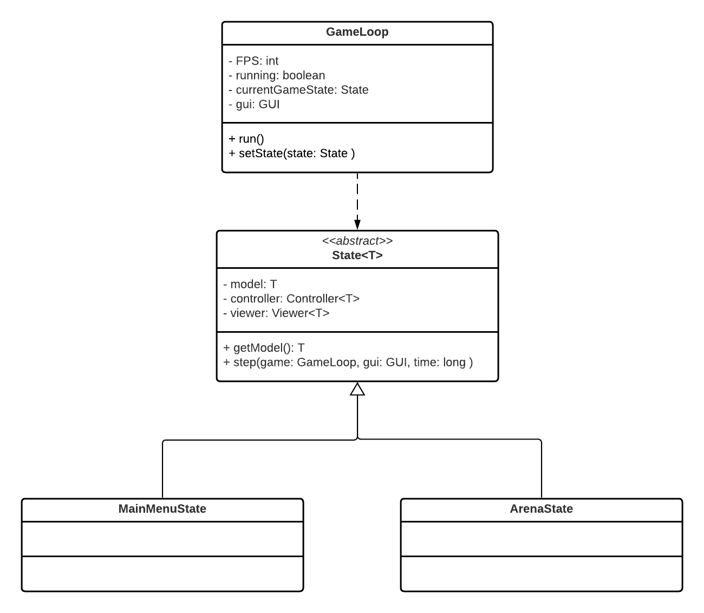
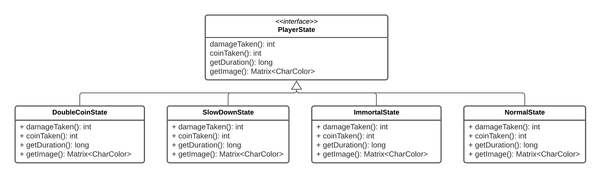

# LPOO-2021-g73 - Jetpack Joyride

This project was developed by:
- Adriano Soares (up201904873@edu.fe.up.pt)
- Catarina Pires (up201907925@edu.fe.up.pt)
- Francisco Cerqueira (up201905337@edu.fe.up.pt)

## Table of contents
1. [Description](#description)
2. [Implemented features](#implemented-features)
3. [Planned features](#planned-features)
4. [Design](#design)
    1. [Arena Builder](#i-arena-builder)
    2. [Game Loop](#ii-game-loop)
    3. [Movement Strategy](#iii-movement-strategy)
    4. [States](#iv-game-states)
    5. [Power Ups](#v-power-ups)
5. [Code smells and refactoring techniques](#code-smells-and-refactoring-techniques)
6. [Testing](#testing)

## Description
In this game, the Player's primary goal is to travel as far as possible, while collecting coins, and avoiding hazards such as Energy Walls and Laser Beams.

## Implemented features

- [x] Movable Objects:
  - [x] Player
  - [x] Coins
  - [x] Obstacles (Laser and EnergyWall)

- [x] Arena Builder - we created a random arena builder (RandomArenaBuilder)
- [x] Information bar - we created a window that has the player's information and, inside it, is the arena where the game runs
- [x] Collisions

## Planned features

- [x]  Objects:
    - [x] Static obstacles
    - [x] Obstacle with different movements

- [x] Movements:
    - [x] Player falls with gravity
    - [x] Movements aside from going left (Obstacles)
    
- [x] Menus
- [ ] Levels:
    - [x] Increase the difficulty linearly throughout a play through
    - [x] Improve Random Infinite
    - [x] Score (Distance)
    - [ ] Pre-built Levels
- [x] Power-ups:
    - [x] Double coins
    - [x] Shield
    - [x] Slow down time

## Design
### i. Arena Builder
#### Problem in context

To allow the creation of an Arena of multiple ways, randomly or by reading it from a file.

#### The pattern

To solve this problem, we implemented a Factory Method that creates specific Arenas depending on the what form of arena creation we want.

#### Implementation

To implement the Factory Method we created an abstract class, *ArenaBuilder*, that specifies what each arena creator must be able to create (player, coins, obstacles, etc). Then, various strategies of building an arena can implement/override the methods of the abstract class accordingly. If, for some reason, we want to add new methods to create arenas afterwards, we only need to specify the target platform when the application starts. This way, the wanted arena builder is instantiated and used throughout the rest of the program, not having to worry with the specific type in use.

#### Consequences

By using the Factory Method, each target platform has its own isolated concrete class, which can be implemented differently. In addition, it makes exchanging product families easy, only needing to call a different constructor at the start of the program, since they extend the same abstract class.

### ii. Game Loop
#### Problem in context

In order to control the main cycle of the game, we need a way to make sure the game runs properly, processes the input and renders accordingly with a certain amount of frames per second.

#### The pattern

The pattern Game Loop runs continuously during the gameplay. Each turn it processes the user input without blocking it, updates the game state, renders the game and tracks the passage of time to control the rate of the gameplay.

#### Implementation

To implement the Game Loop pattern we created a class, *GameLoop*, that contains the three main methods stated above, and some other utility functions.

#### Consequences

The Game Loop pattern allow us to have more control in the way the game runs and separate each processing.

### iii. Movement Strategy

#### Problem in context

In order for the objects to have different types of movement, we needed to specify their movement.
This information could be placed in model, in each object's class, but this shouldn't be a concern to the element, hence why we implemented this design pattern.

#### The pattern

To solve this problem we used the Strategy Pattern. This pattern allows us to isolate the distinct movements into classes away from the object, making them interchangeable. With this, we are able to separate the movement algorithm from the objects, so we can easily switch their behaviors and add new ones.

#### Implementation

#### Consequences

With this pattern, we can eliminate the possibility of differentiating each behavior with conditional statements and substitute them with classes that have different implementation accordingly. Each object does not have to know its type of movement.

### iv. Game States
#### Problem in context

We wanted to switch from different states smoothly as the game proceeded, from the Menus to the Game itself for instance.

#### The pattern

To implement the different states of the game, as the name implies, we used the State Pattern. This pattern allows the implementation of each state as subclass. If so, we can switch from different states only by switching to another class/state.

#### Implementation

#### Consequences

This pattern facilitates the creation of more states for the game and changes to the ones already created.
The creation of different states gives us freedom to differentiate behaviors depending on the actual stage in the game. There's also no need to use flags or complex if statements. However, this means that there will be more classes in the game.

### v. Power Ups

#### Problem in context

The player should have different attributes/stats/power-ups throughout the course of the game.

#### The pattern

To implement the power-ups we used the State Pattern. This pattern consists on creating an Interface (or an abstract class), *PlayerState* in our case, and implementing it accordingly in the various power-ups that we want  to feature. The Player class stores the state and changes it's behavior according to it.

#### Implementation

#### Consequences

With this pattern we can interchange *powerUps*/*playerStates* easily. We can separate the Player from the State, since it doesn't need to know it's behavior, leaving the responsibility to the state itself.
We wanted to change the Player's appearance depending on the state it encounters itself in, this resulted in a minor inconvenience: since we save the Image of a certain Element in the model itself we found ourselves obligated to save the Image in the State. On the other hand, this eases the implementation of this feature, and, in our opinion, enhances the readability of the code.

## Code smells and refactoring techniques

### Bloaters

#### Primitive Obsession and Data Clump

- [x] Currently, the size of the arena is represented as two integers, which are used several times in different parts of the code. This code smell can be fixed by creating a class which will be responsible for managing these variables.

#### Long Parameter List

- [x]  The method checkBoxCollision() has eight arguments, receiving two points and two dimensions. This issue can be solved by changing the given parameters to classes that'll group the variables.

### Object-Orientation Abusers

#### Switch Statements

The method responsible to interpret the user's input has a lot of if statements to map each input key to an action. Unfortunately, it's not easy to solve this problem, as there are no obvious alternatives. The function responsible for generating random obstacles also has the same issue.

### Change Preventers

#### Parallel Inheritance Hierarchies

As we are using the MVC architecture, this implies that almost every object from the Model should have a controller and viewer class. Each game state also need to have a correspondent controller and viewer. We thought a lot about this code smell and we haven't encountered an easy fix for this problem without violating the SOLID principles yet.

### Dispensables

#### Comments

- [x] As our project is still in the beginning, it has a lot of comments to help us to understand what we're doing (especially TODO's). This should (and will) be fixed in the final delivery.

#### Duplicate Code

- [x] Currently, we have a method that has a lot of code fragments which are identical, as we are still thinking about the structure of that specific part. We think that this can be fixed improving the code structure and creating generic methods. 

#### Data Class

Our game uses a data class to store the image (structure) of the various elements. We think that with this singleton our code is more organized.

#### Speculative Generality

- [x] We have some methods, like *checkImageCollision* and some getters and setters, that are not being used, but were created to support anticipated future features. This will obviously be fixed until the final delivery, as these features will be used/implemented.

### Couplers

#### Message Chains

- [x] The *WindowViewer* class calls methods of the *ArenaViewer* class, that will call some other methods of the *ElementViewer* class. This is a chain of calls that we would like to improve and simplify until the final delivery, by reviewing the structure of the code.

## Testing

> TODO

### Test Coverage

> TODO

[Link to the reports in HTML format](testResults/html)